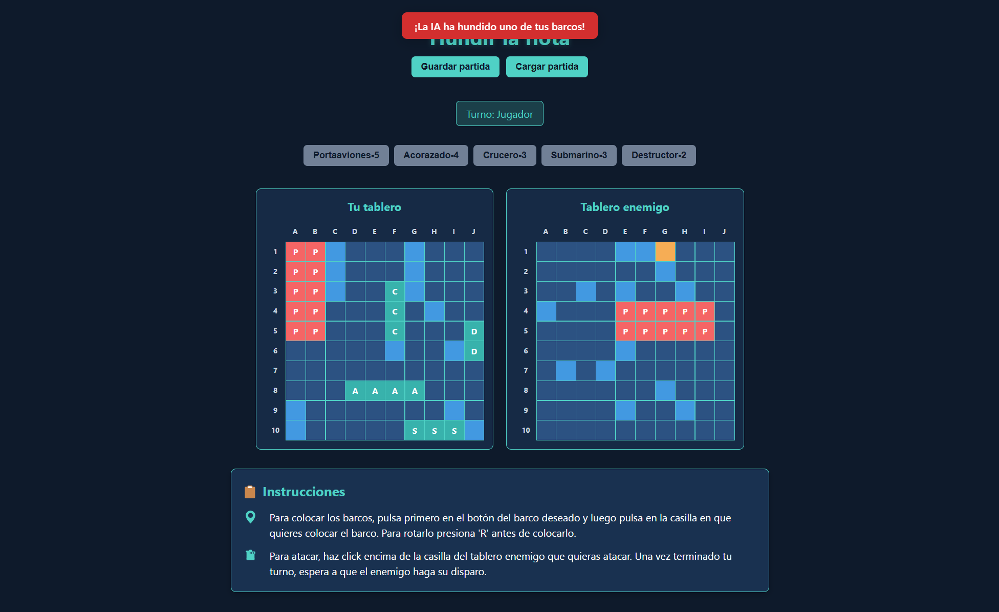
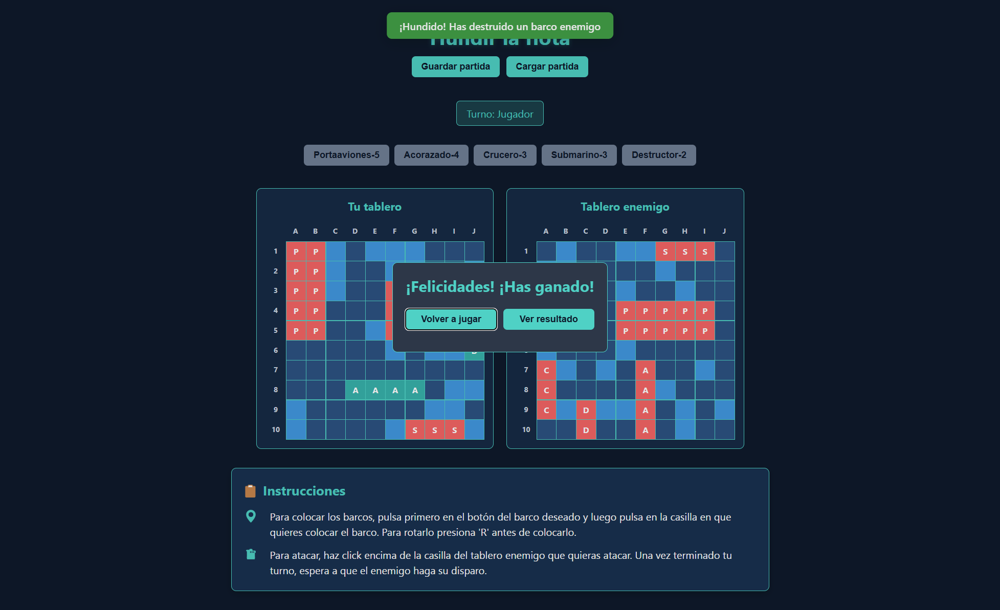

# Hundir la Flota

Este es un proyecto académico desarrollado para la asignatura de **M6 (Javascript)** del ciclo formativo de **Desarrollo de Aplicaciones Web (DAW)**. El objetivo es crear una versión web del clásico juego "Hundir la Flota" (Battleship), con funcionalidades modernas y una arquitectura dividida en frontend y backend.

## Descripción del proyecto

El juego permite a un usuario jugar contra la IA (inteligencia artificial) colocando sus barcos en un tablero y atacando el tablero enemigo. El proyecto está dividido en dos partes principales:

- **Front**: Interfaz de usuario desarrollada en HTML, CSS y JavaScript moderno (ES6+), donde el usuario puede interactuar con el juego de forma visual.
- **API**: Backend realizado con Node.js y Express, encargado de guardar y cargar partidas en un archivo JSON.

### Funcionalidades principales

- Colocación manual de barcos con opción de rotación (horizontal/vertical).
- IA que coloca sus barcos aleatoriamente y responde a los ataques del jugador.
- Sistema de turnos entre jugador y IA.
- Detección de barcos tocados y hundidos.
- Mensajes visuales para avisos, errores y resultados de la partida.
- Guardado y carga de partidas mediante una API REST (persistencia en archivo JSON).
- Ventanas emergentes para indicar victoria o derrota.
- Interfaz responsive y moderna.
- Instrucciones integradas para facilitar el uso.

## Estructura del proyecto

```
API/
    package.json
    server.js
    controllers/
        partidasController.js
    data/
        partidas.json
    routes/
        partidas.js
    utils/
        idGenerator.js
Front/
    Barco.js
    Celda.js
    index.html
    script.js
    styles.css
    Tablero.js
        ...
```

## Instrucciones de instalación y uso

### 1. Clonar el repositorio

```sh
git clone https://github.com/tu-usuario/hundir-la-flota.git
cd hundir-la-flota/API
```

### 2. Instalar dependencias del backend

```sh
npm install
```

### 3. Iniciar el servidor backend

```sh
npm start
```

El servidor escuchará en [http://localhost:3000](http://localhost:3000).

### 4. Abrir el frontend

Abre el archivo `Front/index.html` en tu navegador (puedes hacer doble clic o usar una extensión de servidor local como Live Server en VS Code para evitar problemas de CORS).

## Capturas de pantalla

### El juego en acción


### Mensaje de victoria


## Créditos

Proyecto realizado por Agustí López para la asignatura de **M6 (Javascript)** del ciclo **DAW**.

---